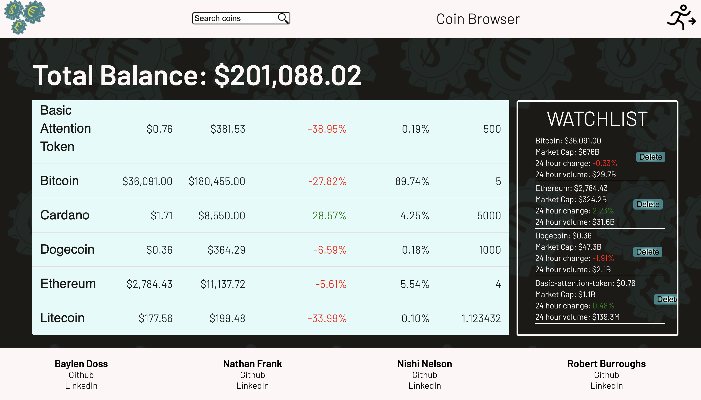
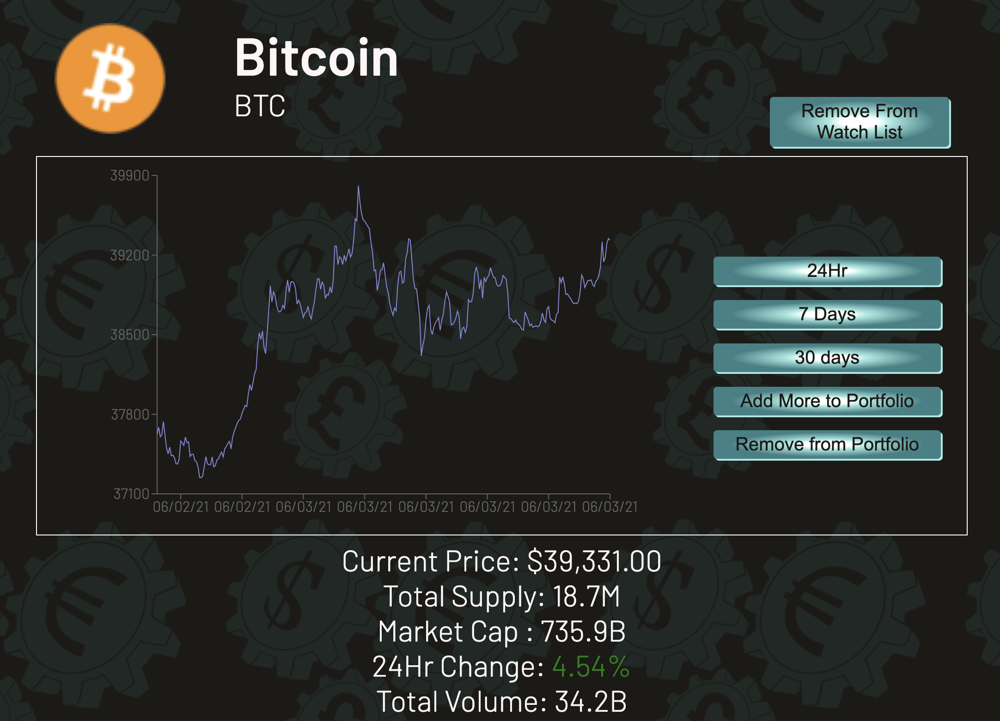
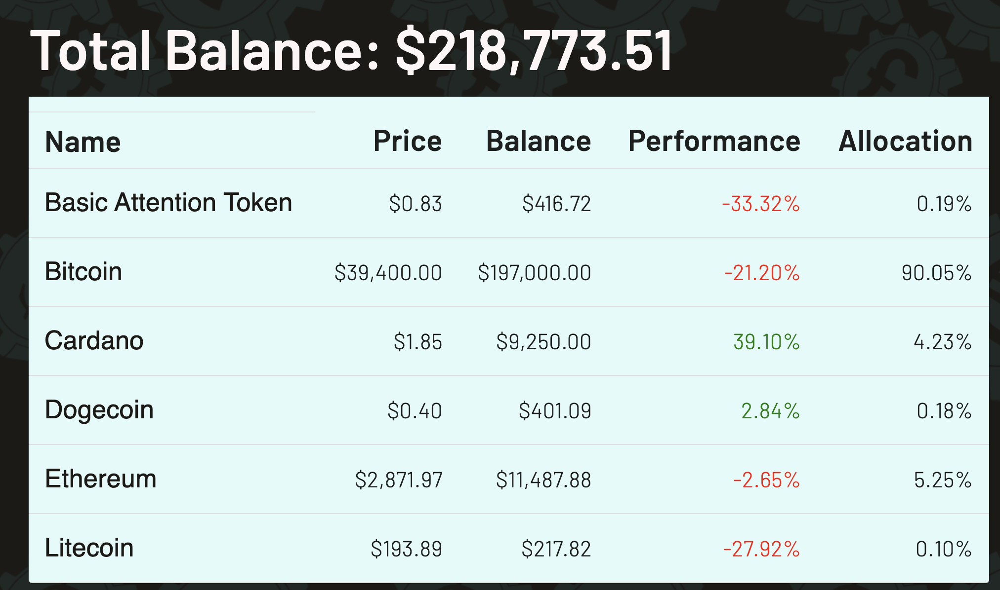
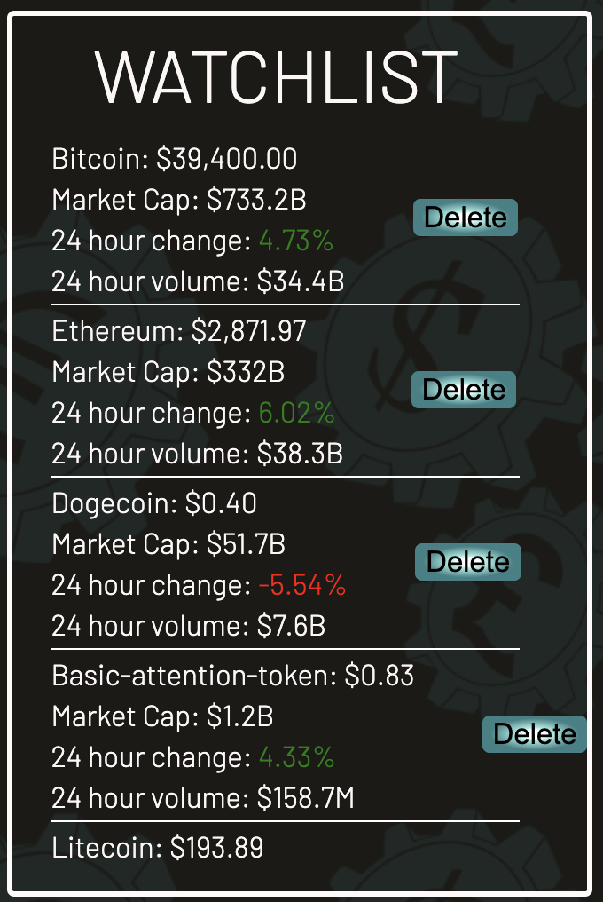
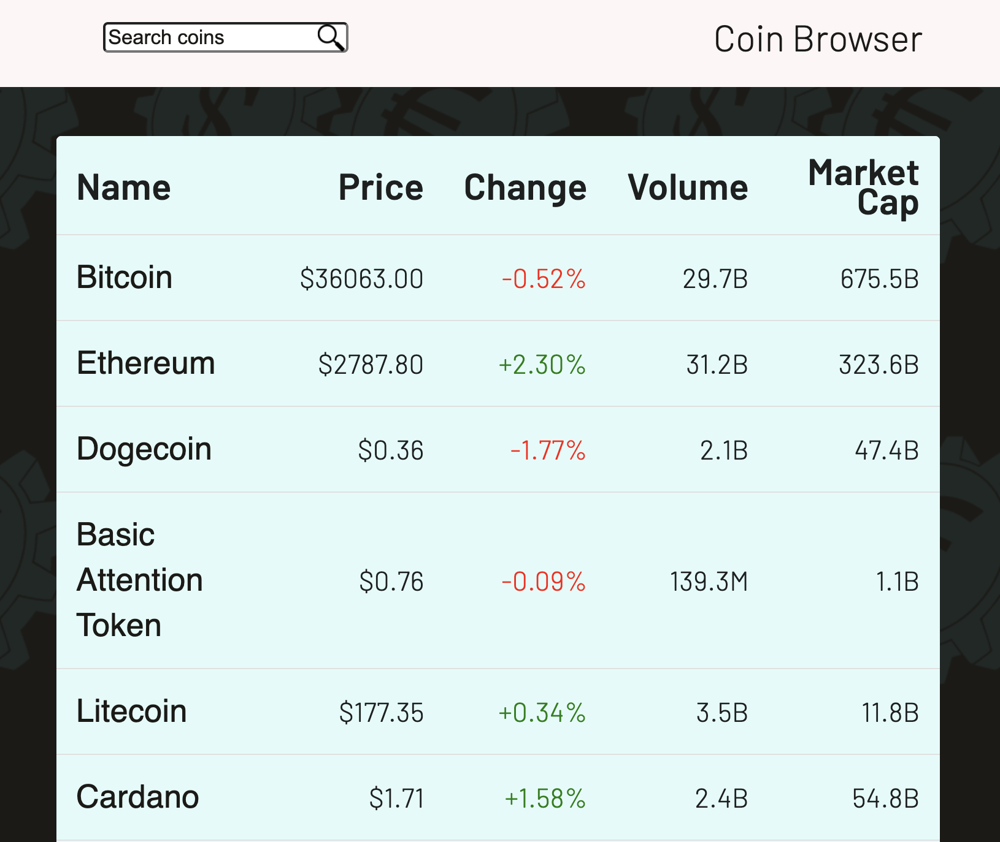
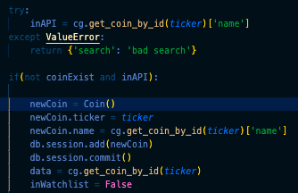

# CoinFlip



Coinflip is an app that allows a user to maintain a profile where they can watch coins using live API data.

- Deployed on Heroku: [CoinFlip](https://cryptocoinflip.herokuapp.com/)

## Technology used
- React
- Redux
- Flask
- Flask-SQLAlchemy
- PostgreSQL
- CoinGecko API
- Material-UI
- Recharts
- WTForms

#### How to clone and spin up from the repo
1. git clone https://github.com/NathanFrank285/Coinflip.git


2. Open two terminals; project-starter contains the backend which we'll run with flask, and the react-app folder holds our frontend.

3. Install dependencies. For the backend, cd into project-starter and:

      ```bash
      pipenv install --dev -r dev-requirements.txt && pipenv install -r requirements.txt
      ```
      And for the frontend, cd into react-app and:
      ```bash
      npm install
      ```

4. Setup your PostgreSQL user, password and database and make sure it matches your **.env** file

5. Get into your pipenv, migrate your database, seed your database, and run your flask app

   ```bash
   pipenv shell
   ```

   ```bash
   flask db upgrade
   ```

   ```bash
   flask seed all
   ```

6. To spin up the app, on the backend:

   ```bash
   flask run
   ```

   And on the frontend:

   ```bash
   npm start
   ```

7. Create an account or login as the demo user. Enjoy!

## Features
- Coin Detail page featuring a line graph displaying data over a day, a week, or a month. This data is pulled from the CoinGecko API. We also provide other details about the coin below the graph.

- A Dashboard/Portolio where the user can view a table displaying data about the coins they "own" and see how much their portfolio would be worth in USD.

- A watchlist where the user can keep track of coins they are interested in.

- A search bar or a browsing page that enable the user to find coins of interest.


## Notable code snippets


- We recognized that users might search for coins in the browser url by typing in a ticker name that might not be available in our database yet. We implemented logic that initially checks if that coin name exists in the api, but is not in our database. If that is true, we add the coin to our database, then redirect the user to that newly added coin's page.
