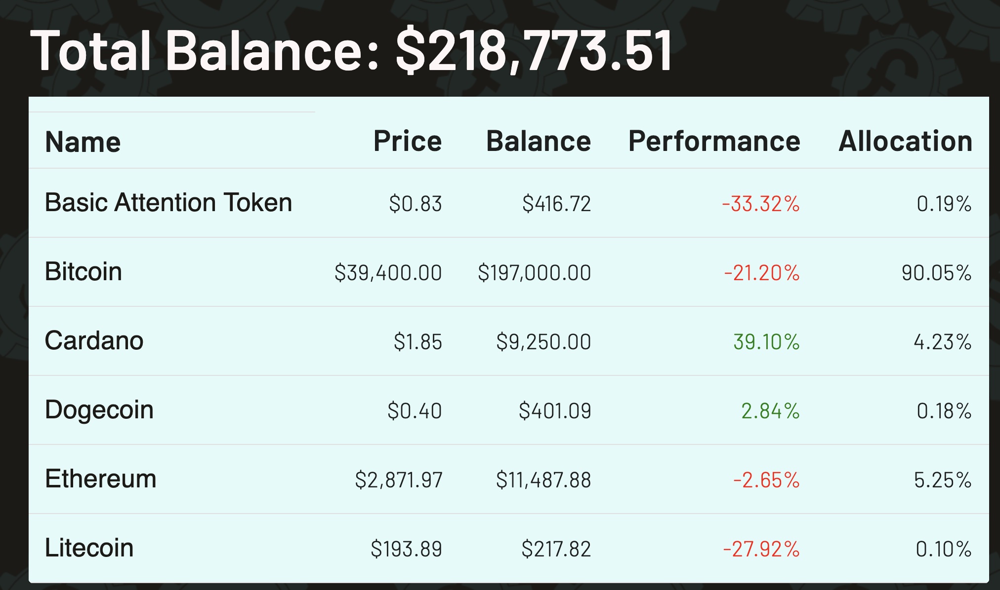
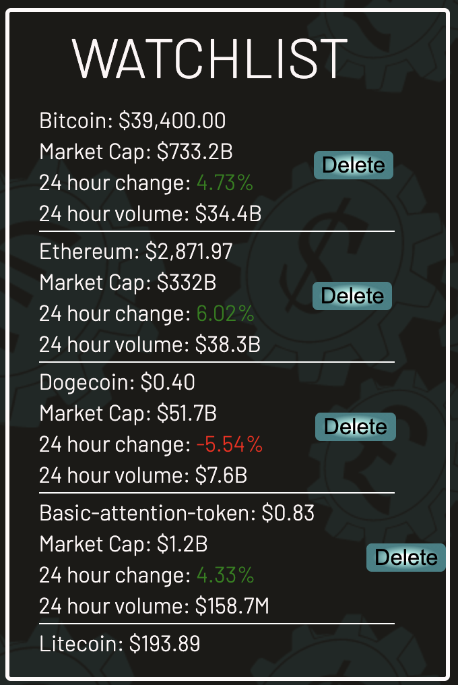

# Coinflip

## Cryptocurrency Tracker App

Coinflip is an app that allows a user to maintain a profile where they can watch coins using live API data. 

## Features
- Coin Detail page featuring a line graph displaying data over a day, a week, or a month. This data is pulled from the CoinGecko API. We also provide other details about the coin below the graph.

- A Dashboard/Portolio where the user can view a table displaying data about the coins they "own" and see how much their portfolio would be worth in USD. 

- A watchlist where the user can keep track of coins they are interested in. 

- A search bar or a browsing page that enable the user to find coins of interest.
